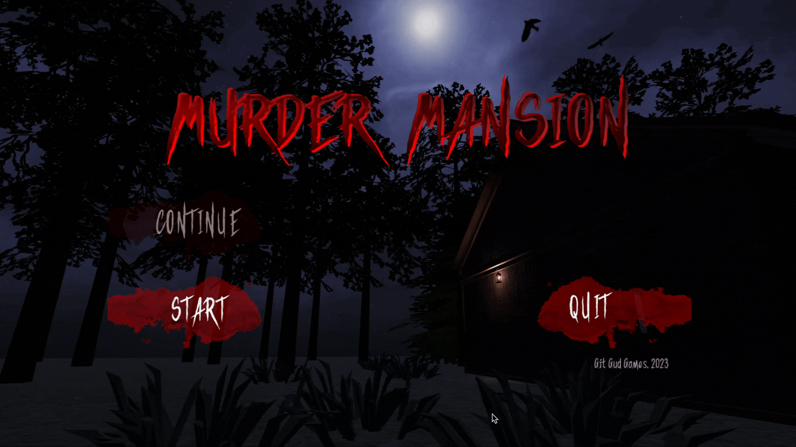

## Murder Mansion

Murder Mansion is a single-player puzzle game with a mystery/horror-themed escape room setting where the player assumes the role of an abandoned child locked away in a mysterious mansion. The player's objective is to escape the manor by investigating the environment, finding clues, and solving puzzles before the murderer catches them.

### System requirements

- OS: **Windows 10** / **MacOS 12+ (x86 + apple silicon)** / **Linux** 
- Memory: Minimum **1 GB RAM**
### How to play the game
| Control    | Action                                        |
|------------|-----------------------------------------------|
| WASD       | Move around                                   |-  
| Left Click | Interact/Pickup items/Drag Drop items         |-  
| E          | Toggle Inventory on off                       |-
| TAB        | Reveal Interactable Items                     |-
| Space      | Skip Monologues/Voice Acting                  |-
| Esc        | Exit Inventory/Exit from Zoom/Open Pause Menu |-  

### Gameplay

A link to your gameplay recording video

### Contributors

| Name                | Role                | Student ID |
|---------------------|---------------------|------------|
| Umang Sanjeev Gupta | Software Architect  | 1005393    |
| Koh Jia Jun         | VFX Designer        | 1005453    |
| Jaron Ho            | Audio Designer      | 1005011    |
| Eliana Setiabudi    | Graphic Designer    | 1005252    |
| Divy Chandra        | Level Designer      | 1005246    |
| Charles Lim         | Software Developer  | 1003158    |

### [Asset Used & Credits](./credits.md)
